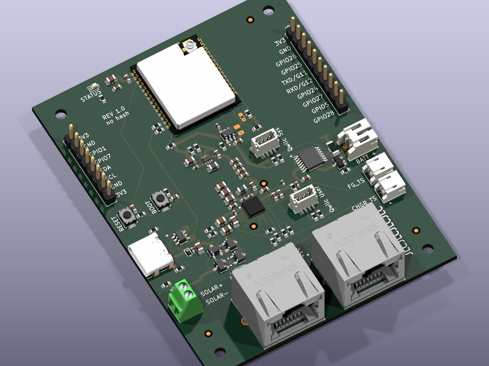
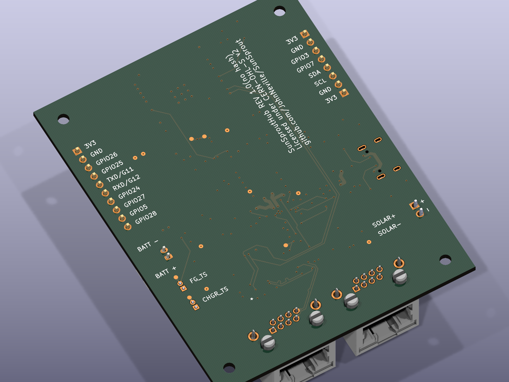

# Design Files & Key Components

## Key components

| Ref | Part | Function |
|---|---|---|
| U1 | ESP32-C5-WROOM-1U | Main MCU, Wi-Fi 6 / Bluetooth 5 / 802.15.4 / CAN FD radio module |
| U8 | BQ25798 | Li-ion/Li-Po battery charger |
| U3 | BQ34Z100 | Fuel gauge |
| U4 | TPS631000 | Buck-boost regulator, 3.3V system rail |
| U5 | TPS22918 | Load switch, switched 3.3V user rail |
| U201 | PCA9615 | Differential I2C buffer, drives the two 8P8C jacks |
| D5, U202 | USBLC6-4SC6-ES | USB-C and I2C-buffer ESD protection |
| Q1, Q2 | MDD3415, DMP3098L-7 | Reverse-polarity protection on the battery and DC/solar inputs |

For why each of these parts was chosen, and why its surrounding passives have the values they
do, see the per-IC design notes in the repository's `docs/hub/modules/` folder.

## A note on the BOM

The bill of materials is optimised for **small-batch assembly**, not for volume production.

Assembly houses charge a one-off setup fee per distinct part number on top of each component's
per-unit price. On a run of tens of boards, that setup cost dominates — so this design
deliberately fits a higher-specified part where a cheaper one would do, whenever that part is
already used elsewhere on the board. All the 4.7 µF positions share one 25 V 0805 part, for
instance, even where 6.3 V would be sufficient.

That yields 61 distinct part numbers across 112 placements. If you intend to build this at
volume, revisit those choices: once per-unit cost dominates, fitting the cheapest adequate part
in each position is the cheaper answer. Nothing electrical depends on it.

## Downloads

Published with the site:

- **[Schematic (PDF)](pathname:///SunSprout/SunSproutHub-schematic.pdf)** — all sheets, regenerated
  directly from the `.kicad_sch` source.
- **[Interactive BOM](pathname:///SunSprout/ibom/)** — hover any reference designator to
  highlight it on the board.

Published per release, on the [Releases
page](https://github.com/JohnNeville/SunSprout/releases):

- **3D model (STEP)** — board mechanical model, including the MCU module. Every part carries a
  3D model, embedded in the board file itself, so the export is complete.
- **Gerbers, BOM, and pick-and-place** — the JLCPCB-format fabrication set.

The STEP model is about 19 MB and changes with every layout edit, so it ships as a release
asset rather than living in the repository, where each regeneration would add another copy to
the history permanently.

Everything above is a build artifact of the KiCad source. Regenerate the site assets with
`tools/generate-docs-assets.sh` and the fabrication set with `tools/generate_jlcpcb_bom.sh`.
Docker is the only prerequisite; no local KiCad install is needed.
